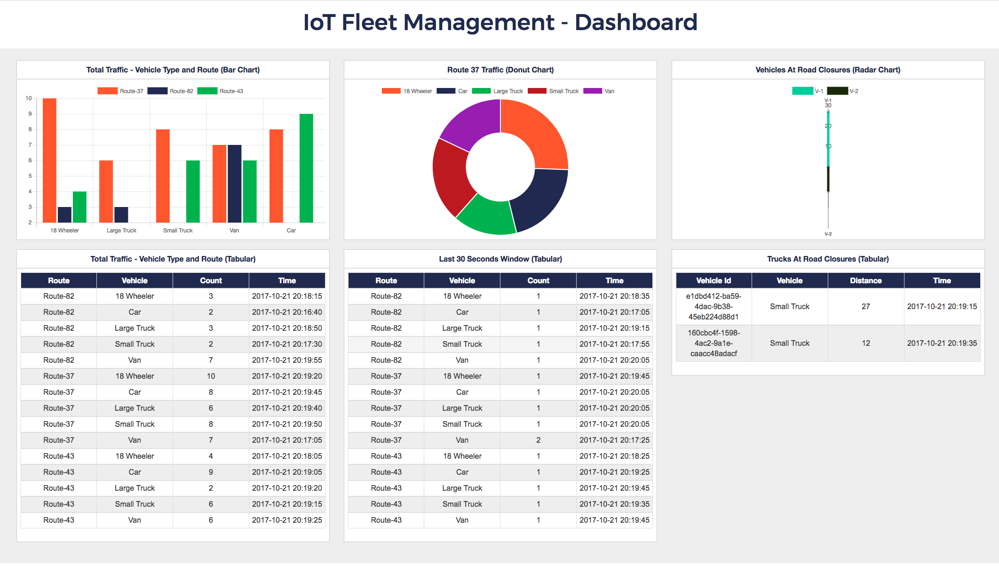
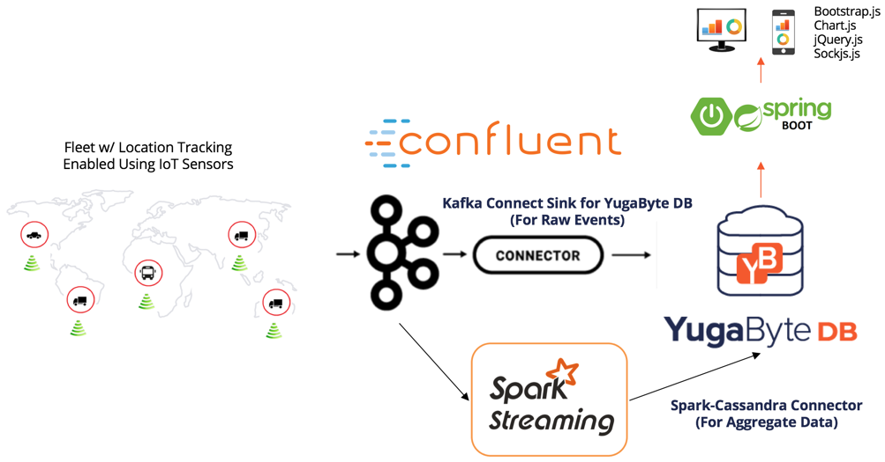

# IoT Fleet Management

YugaByte DB is world's 1st open source database that is both NoSQL (Cassandra & Redis compatible) and SQL (PostgreSQL compatible) at the same time. It is purpose-built to power fast-growing online services on public, private and hybrid clouds with transactional data integrity, low latency, high throughput and multi-region scalability while also using popular NoSQL and SQL APIs.

This is a sample application that shows how real-time streaming applications (such as those in the IoT vertical) can leverage YugaByte DB as a highly reliable, elastic operational database. It uses YugaByte DB's Cassandra-compatible YCQL API.

## Scenario

Here is a brief description of the scenario.

Assume that a fleet management company wants to track their fleet of vehicles, which are of different types (18 Wheelers, busses, large trucks, etc).

Below is a view of the dashboard of the running app.



The above dashboard can be used to monitor the different vehicle types and the routes they have taken both over the lifetime of the app as well as over the last 30 second window. It also points out the trucks that are near road closures, which might cause a delay in the shipping schedule.


## Architecture

The IoT Fleet Management application contains the following four components:

- IoT Kafka Producer
  This component emulates data being emitted from a connected vehicle, and generates data for the Kafka topic `iot-data-event`. The data emitted is of the format shown below.
  ```
  {"vehicleId":"0bf45cac-d1b8-4364-a906-980e1c2bdbcb","vehicleType":"Taxi","routeId":"Route-37","longitude":"-95.255615","latitude":"33.49808","timestamp":"2017-10-16 12:31:03","speed":49.0,"fuelLevel":38.0}
  ```

- IoT Real-Time Data Processor
  This component reads data from Kafka topic `iot-data-event` and computes the following:
  - Total traffic snapshot
  - Last 30 seconds traffic snapshot
  - Vehicles near a point of interest

  There are two ways the app can perform this analysis. First is through KSQL, Confluent's SQL-like streaming query language for Kafka, and second is through Apache Spark as an external stream processing engine.

- IoT Database
  This component is based on YugaByte DB. YugaByte DB's Cassandra-compatible YCQL API is used to integrate with other components of the app.

- IoT Spring Boot Dashboard
  This app uses the Java Spring Boot framework with its integration for Cassandra as the data layer, using the Cassandra Query Language (CQL) internally.

### Architecture with Apache Spark Streaming


## Prerequisites

For building these projects it requires following tools. Please refer README.md files of individual projects for more details.
- JDK - 1.8.x
- Maven - 3.3 +
- Confluent Open Source - 7.4.0 (we assume this is installed in the `$HOME/yb-kafka/confluent-os/confluent-7.4.0` directory).

## Run using kubernetes
Refer [here](https://github.com/YugaByte/yb-iot-fleet-management/tree/master/kubernetes/helm) for the setup and run steps using a helm based kubernetes environment.

## Steps to setup local environment
1. Clone this repository.
   ```bash
   git clone https://github.com/btjimerson/yb-iot-fleet-management.git
   ```

2. Download Confluent Open Source from https://www.confluent.io/download/. This is a manual step, since an email id is needed to register.
   Unbundle the content of the tarball to location `~/yb-kafka/confluent-os/confluent-7.4.0` using these steps.
   ```
   mkdir -p ~/yb-kafka/confluent-os
   cd ~/yb-kafka/confluent-os
   tar -xvf confluent-7.4.0.tar
   ```

3. Start Kafka and related components.
   ```
   export CONFLUENT_HOME=$HOME/yb-kafka/confluent-os/confluent-7.4.0
   export PATH=$PATH:$HOME/yb-kafka/confluent-os/confluent-7.4.0/bin
   confluent local services start
   ```

   The output for the `confluent status` should look like this:
   ```
   ZooKeeper is [UP]
   Kafka is [UP]
   Starting Schema Registry
   Schema Registry is [UP]
   Starting Kafka REST
   Kafka REST is [UP]
   Starting Connect
   Connect is [UP]
   Starting ksqlDB Server
   ksqlDB Server is [UP]
   Starting Control Center
   Control Center is [UP]
   ```
4. Install YugaByte DB.
   
   [Install YugaByte DB and start a local cluster](https://docs.yugabyte.com/quick-start/install/).

5. Create the YugaByte DB tables
   
   Create the keyspaces and tables by running the following command. You can find `cqlsh` in the `bin` sub-directory located inside the YugaByte installation folder.
   ```
   cqlsh -f resources/IoTData.cql
   ```

## Running the application

There are sample scripts in the [bin](./bin/README.md) directory that you can use to run the application. Alternatively, do the following from the root of this repository:

1. Start and launch the data producer.
   ```bash
   mvn clean package spring-boot:run -f iot-kafka-producer
   ```

   Open a browser and go to `http://localhost:9080`, and then click 'Start Event Producer'. It should start emitting data points to the Kafka topic. You should see something like the following as the output on the console:
   ```
   2017-10-16 12:31:52 INFO  IoTDataEncoder:28 - {"vehicleId":"0bf45cac-d1b8-4364-a906-980e1c2bdbcb","vehicleType":"Taxi","routeId":"Route-37","longitude":"-95.255615","latitude":"33.49808","timestamp":"2017-10-16 12:31:03","speed":49.0,"fuelLevel":38.0}

   2017-10-16 12:31:53 INFO  IoTDataEncoder:28 - {"vehicleId":"600863bc-c918-4c8e-a90b-7d66db4958e0","vehicleType":"18 Wheeler","routeId":"Route-43","longitude":"-97.918175","latitude":"35.78791","timestamp":"2017-10-16 12:31:03","speed":59.0,"fuelLevel":12.0}
   ```

   To stop sending data to the topic, click 'Stop Event Producer' in the web page.

2. Start the data processing application

    _OPTIONAL_ Create a Java keystore with your SSL certificate if SSL is being used:
    ```bash
    keytool -genkey -alias yb -keyalg RSA -keystore $HOME/ybkeystore.jks
    keytool -importcert -alias ybcert -file root.crt -keystore $HOME/ybkeystore.jks 
    ```
  
    Set the following environment variables:
    - CASSANDRA_HOST
    - CASSANDRA_PORT
    - CASSANDRA_USERNAME
    - CASSANDRA_PASSWORD
    - CASSANDRA_SSL_ENABLED
    - CASSANDRA_KEYSTORE (only if sslEnabled=true)
    - CASSANDRA_KEYSTORE_PASSWORD (only if sslEnabled=true)
    
    Run the spark app:
    ```bash
    mvn clean package -f iot-spark-processor
    java -jar iot-spark-processor/target/iot-spark-processor-1.0.0.jar
    ```
3. Start the Dashboard application

   Set the following environment variables:
   - CASSANDRA_HOST
   - CASSANDRA_PORT
   - CASSANDRA_USERNAME
   - CASSANDRA_PASSWORD
   - CASSANDRA_SSL_ENABLED
   - CASSANDRA_SSL_CERTIFICATE (only if sslEnabled=true) _This should be the path to the certificate file_
   
   Start the application
   ```bash
   mvn clean package spring-boot:run -f iot-springboot-dashboard
   ```

4. Open the Dashboard UI
   ```
   open http://localhost:8080
   ```
